# Executive summary

For this project we were tasked with producing a Python based intrusion detection system (IDS).
Our IDS is a host based IDS, by that we mean the scanner is ran on each host on the network.
Since we are running on a switched network the IDS can only see traffic to or from the host it is running on.
The IDS implementation protects against NMAP SYN Scans, ACK Scans, and XMAS Scans, Ettercap, Responder, Metasploit's ms17_010_psexec exploit.
We also use various types of detection systems to protect against attacks there are 4 covered: behavioral, anomaly, signature, and heuristic.

# Introduction

## I. Problem Description

Modern networks are constantly under attack from malicious agents whether it be malicious insiders, advanced persistent threats, nation state actors, hacktivist, you name it.
Data breaches can cost businesses hundreds of millions of dollars.
Therefore, it is extremly important to have good network security.
Breaches can have more than just economic repurcussions. 
Employees data can be leaked and their integrity can be compromised and overall trust in the leaked company will go down as well.
To combat against these attacks it is imperitive to have a network to be up to date as possible but it is also important to analyze network traffic for attacks. 
However, manually analyzing data streams is feasibly impossible especially for large networks.
To combat this intrusion detection systems can be used to slim down the amount of data analyst have to sift through.

This framework is a Python implementation for an Intrusion Detection System. 
It aims to detect NMAP SYN Scans, ACK Scans, and XMAS Scans, Ettercap ARP Poisoning, Metasploit's ms17_010_psexec exploit, and Responder's Windows DNS spoofing. 
The framework uses different IDS methods to achieve this goal.

## II. Background

### 1. Intrusion Detection System

Software or device that analyzes network traffic for malicious activity.
Malicious activity is usually flagged, with the administrator of the network being notified of the incident.
IDS systems can also be configured to stop detected intrusions.

### 2. Host Based Intrusion Detection System

A host based IDS is an intrusion detection system that is run on the computers on the network.
The opposite of a host based IDS is a *network based IDS* where the IDS is instead run on the network switches / routers.
The downside for a host based IDS is while running on a switched network an IDS will only be able to see traffic destined to or from the host it is running on.
This is due to the fact that on switched networks the switch will only forward packets to the intended ports.
If it was a hub network, a Wi-Fi network, or the switch was configured to have a trunk port then a host based IDS would be able to see all the traffic on the network.

### 3. Behavior IDS

Analyzes traffic using a *known baseline*.
If the traffic is not close to this baseline the traffic will be flagged.
An example would be if a network is known to only have FTP traffic but for some reason there is now packets using SSH and SFTP traffic it should be flagged.
Of course in this example a user could have spun up a box that uses SSH or SFTP but since the baseline is used to seeing only FTP it is abnormal traffic.

### 4. Anomaly IDS

Attempts to find abnormal *protocol* activity.
Protocols adhere to strict guidelines, most are defined in RFCs.
If for instance, there is traffic on a network that shows a protocol not adhering to its normal activity it should be flagged.
This is different from a behavior IDS because it is focused on *protocol* activity while behavior is focused on looking at what is *normal* for a network.

### 5. Signature IDS

Searches network traffic for **specific patterns**.
Malicious traffic usually has telltale signs, and if these *signs* are seen in packets they should be flagged as malicious.
If for instance it is known that a recent strain of a popular malware communicate with a server **www.bad_malware.com** on port **8080** then any packets destined to this address and port should be flagged.

### 6. Heuristic IDS

Uses algorithms or *simple rules* to determine compromise.
Can combine signature, anomaly, and behavior tactics.
For example it would be odd for a single IP to scan multiple different ports with a payload of zero data.
A simple rule could check and see if a unique IP has more than 20 unique destination ports plus using the signature of length zero data packets.
If this rule is triggered one can assume it is malicious.

### 7. NMAP

A free and open-source network scanner and mapper tool used both by information security experts and malicious users.
NMAP provides a huge number of features for scanning and probing networks.

### 8. Ettercap

A 'multipurpose sniffer/content filter' for man in the middle attacks.
It was originally created as a sniffer for switched LANs, but evolved into a tool meant for man-in-the middle-attacks. 

### 9. Responder

A tool that allows us to use LLMNR, NBT-NS, and MDNS poisoning. What this means is that we can use an LLMNR and NBT-NS Spoofing attack against a network. This sort of attack takes advantage of default Windows configurations in order to achieve its end goal. 

### 10. Link-Local Multicast Name Resolution (LLMNR) 

A protocol based on the Domain Name System packet format that allows hosts to perform name resolution for hosts on the same local link.

### 11. NetBIOS-NS (NBT-NS)

Name Service provided by NetBIOS that provides name registration and resolution. 
Identifies the systems on a local network by their NetBIOS name.

### 12. NetBIOS

Provides services related to the session layer of the OSI model allowing applications on separate computers to communicate over a local area network.

### 11. Metasploit

A Ruby-based open source penetration testing framework, that allows for a systematic vulnerability probe into a network.
It is operated via a command line interface or graphical user interface, that allows the user to choose the target, exploit, and payload to use against the target system.
This framework gives user the ability to choose from one of the many pre-configured exploits/payloads, or use a custom exploit/payload.

### 12. MS17-010 / CVE-2017-014X 

The MS-010 security update corrects the multiple SMB vulnerabilities discovered in Microsoft Windows that could allow for remote access to a system.
Each exact vulnerability is detailed in CVE-2017-0143, CVE-2017-0144, CVE-2017-0145, CVE-2017-0146, CVE-2017-0147, and CVE-2017-0148.

# Methods

## I. Attack Explanations

### 1. NMAP ACK Scan <sup>[2]</sup>

This scan are different than the other two scans discussed in this report.
Its main purpose is to map out if a firewall is active and filtering certain ports or not.
If a system is *unfiltered*, not running a firewall, *open* and *closed* ports will return a **RST** packet.
However, if a system is *filtered*, running a firewall, ports will not respond at all.
This type of scan *will not* detect if ports are open or closed.

### 2. NMAP SYN Scan <sup>[2]</sup>

This scan is the default scan for NMAP scanning. 
This scan is rather fast and stealthy due to the fact that if never completes a full TCP handshake.
NMAP will send a *SYN* packet and an *open* port will respond with a **SYN/ACK** while a *closed* port will send a **RST**. 
If no response is returned it is assumed the port is *filtered*. 


### 3. NMAP XMAS Scan <sup>[2]</sup>

This scan exploits a behavior built into RFC 793 to differentiate between open and closed ports.
"If the [desintation] port state is *CLOSED* ... an incoming segment nont containing a *RST* causes a *RST* to be sent in response" and. Therefore no response will mean that the port is either *open* or *filtered*. 
The XMAS Scan sets the **FIN**, **PSH**, and **URG** flags. 

### 4. Ettercap <sup>[2]</sup>

The first thing Ettercap does is it scans the network for active hosts. 
Below you can notice several ARP requests in a row all coming from the same host- this is the host discovery step. 
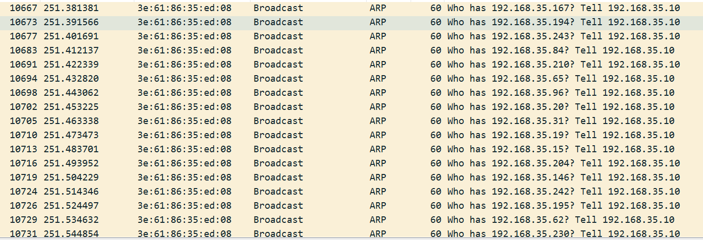

Following that, the attacker selects a victim. Following this selection, the attacker machine sent out gratuitous arp claiming that they are the machine associated with an ip address that they are sitting on. 
This ip address they are claiming to be actually belongs to the victim machine. This message, the gratuitous ARP, is broadcasted on the network, so all the machines listening and learning the network hear it and assume it's true.
They log this information in their ARP tables, and now when traffic is routed to that IP, it is routed to the attacker machine instead of the victim host.

### 5. Responder

Responder out of all the other attacks is by far the most complicated and the one of the ones with the most background knowledge. 
The other being the metasploit exploit.
It is important to understand what a LLMNR and NBT-NS server broadcast is in order to understand how this kind of attack works. When a DNS server request fails, Microsoft Windows systems use Link-Local Multicast Name Resolution (LLMNR) and the Net-BIOS Name Service (NBT-NS) for a “fallback” name resolution. 
This poses a huge threat as if the DNS name is not resolved, then the client (aka the victim in this scenario) performs and unauthenticated UDP broadcast to the network asking all other systems if it has the name that it is looking for.
We can see now why this is a problem as this entire process is unauthenticated and broadcasted to the entire network. 
This allows any machine on the network to respond and claim to be the target machine.

Responder can use an LLMNR and NBT-NS spoofing to poision a network. 
This sort of attack takes advantage of default Windows configurations in order to achieve its end goal. 
It is important to understand what a LLMNR and NBT-NS server broadcast is in order to understand how this kind of attack works. 
When a DNS server request fails, Microsoft Windows systems use Link-Local Multicast Name Resolution (LLMNR) and the Net-BIOS Name Service (NBT-NS) for a “fallback” name resolution. 
This poses a huge threat as if the DNS name is not resolved, then the client (aka the victim in this scenario) performs and unauthenticated UDP broadcast to the network asking all other systems if it has the name that it is looking for. 
We can see now why this is a problem as this entire process is unauthenticated and broadcasted to the entire network. 
This allows any machine on the network to respond and claim to be the target machine.
	
Now that we understand the background of this process, we will proceed to dive deeper on just how an LLMNR and NBT-NS Poisoning Attack works. 
First, the attacker must be actively listening for LLMNR and NetBIOS broadcasts and if this is the case, then it can hide itself on the network to proceed onto pretending as the machine that the victim wants to connect to. 
Once the attacker accepts the connection from the spoofed machine, we can then use this spoofed machine (our attacking machine pretending to be who the victim is looking for) to run the Responder tool and forward on the request to a rouge service that performs the authentication process. 
While this authentication is taking place, the client will send the spoofed machine a NTLMv2 hash for the user that it is trying to authenticate. 
If we can capture this hash, it can be cracked offline of the network with a few of the tools that we have learned this semester such as: Hashcat or John the Ripper. 
A figure of this entire process is shown below to aid your understanding of what kind of attack we are going to perform with the responder tool. 


### 6. CVE

## II. Attack Walkthrough

### 1. NMAP ACK Scan

The NMAP Scans are by far the most trivial to setup. 

* First install NMAP
    * Debian Based Systems
        * sudo apt install nmap -y
    * Mac
        * brew install nmap
    * Windows
        * choco install nmap
* Figure out the IP or IP ranges you wish to scan
* Ensure you are on the network about to be scanned, or can access it
* Run `nmap -sA [ip]`
    * `nmap -sA 192.168.5.10`
    * `nmap -sA 192.168.5.0/24`

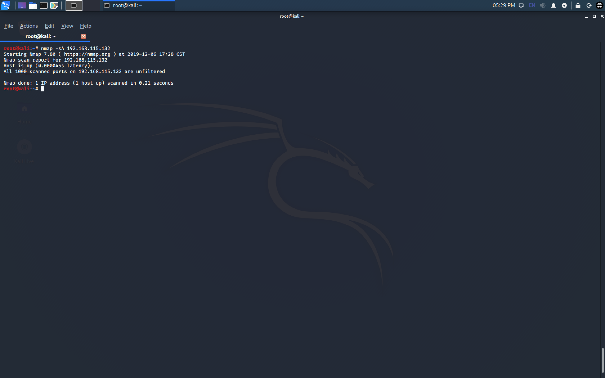

### 2. NMAP SYN Scan

For SYN Scan's the first three steps are the same, ensure NMAP is intalled, and figure out the IP/IP ranges.

* Run `nmap -sS [ip]`
    * `nmap -sS 192.168.5.10`
    * `nmap -sS 192.168.5.0/24`

*Note: SYN Scans are the default scan in nmap so techincally you could just run `nmap ip`*

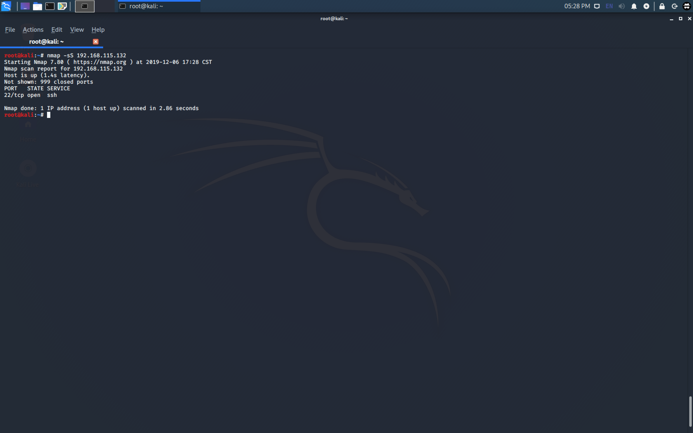

### 3. NMAP XMAS Scan

For XMAS Scan's the first two steps are the same, ensure NMAP is intalled, and figure out the IP/IP ranges.

* Run `nmap -sX [ip]`
    * `nmap -sX 192.168.5.10`
    * `nmap -sX 192.168.5.0/24`


### 4. Ettercap

* First installed ettercap
    * Debian Based: 
        * sudo apt install ettercap -y
    * Mac
        * brew install ettercap 
    * Windows
        * choco install ettercap

* Connect to the network that you will be targeting

*  Open ettercap on the attacking machine
	* `ettercap -G`

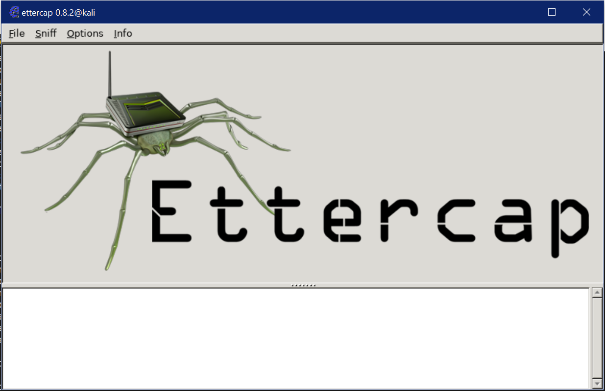

* Select the interface that will be used during the attack
	* To find this we run ifconfig on our attacker machine, and find the
	interface associated with the network we are sitting on:
	
	* In our case, we find that the interface is listed as 'eth0'

	* Select this from the 'unified sniffing' option under the
	the 'Sniff' tab

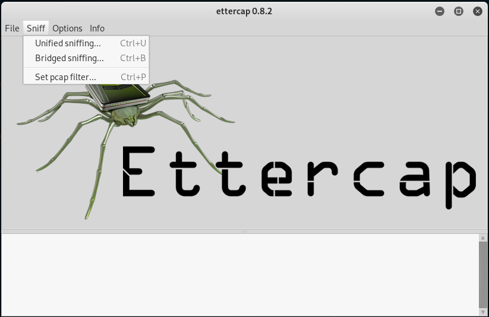

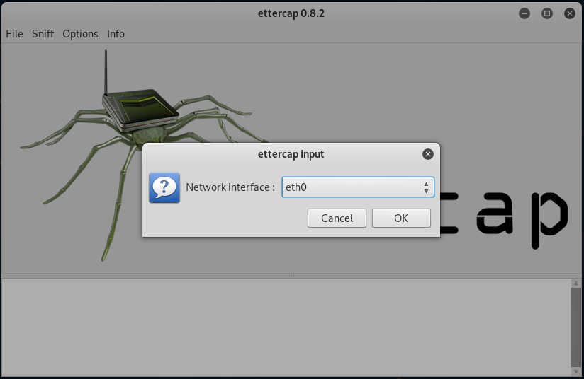

* Identify hosts
	Now for the exciting part, host discovery. ettercap has a host discovery
	function where is sents arp requests for the range of ip on the subnet.
	With those we find 9 different hosts:

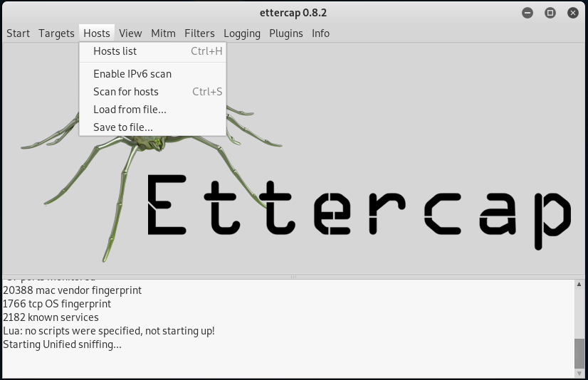

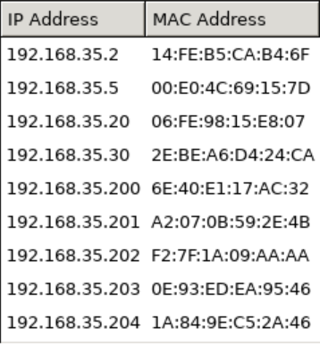

* Select Hosts to target with ARP spoofing
	* next, from the host list, we add the target ip address to 'target 1' and then go to the target list under the target tab
	* From there we highlught the target, navigate the the 'MITM' tab, select ARP Poisoning, and then select the first option, 'sniff remote connections' and let the program do what it does best.

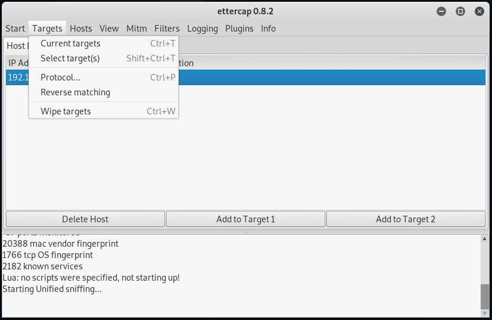

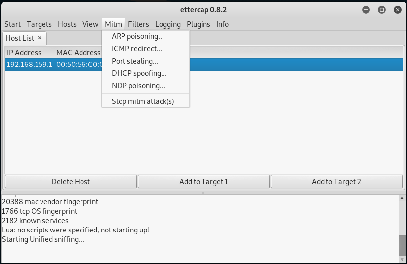

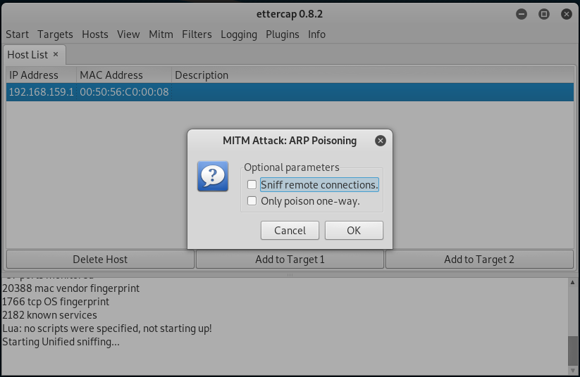

### 5. Responder

We will now show a basic attack with the Responder tool using the Kali Machine (.10) against the Windows Machine (.201). 
For this demonstration, we assume that you have the version that is already installed on the Kali Machine(.10).

The first step in our process is to go ahead and get Responder running on our attack machine. 
We can do this by running the command: `responder -I eth0 -wrFb`

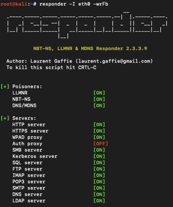

Once we have Responder up and running on our attack machine, we can navigate over to our Windows 7 victim machine (.201) and open up the File Explorer. 
Once here we can click on the top toolbar and enter in ‘\\abc’ to simulate a user tying the wrong SMB server name. 

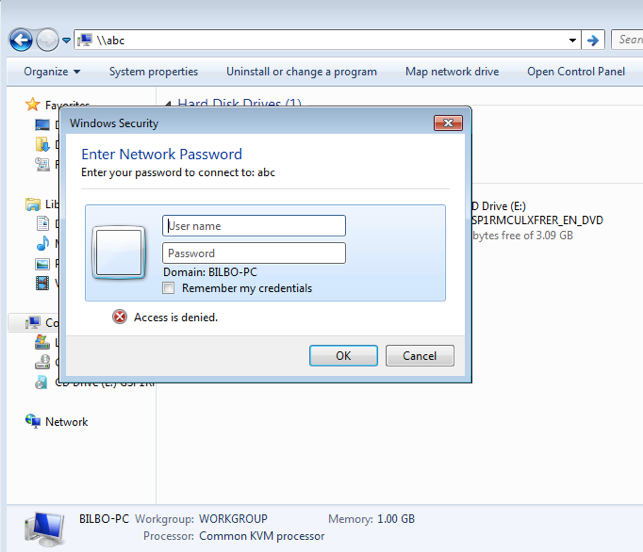

Once the user types in the wrong server name, the DNS lookup fails and therefore our attack begins. 
One we have pressed the ‘Enter’ key after typing this command in the toolbar we can see our Kali Machine with Responder running in the background begins to execute its attack and the only thing we are prompted to do is enter in a username and password on the Windows 7 machine but it does not matter if we do or not because our attack has already taken place. 

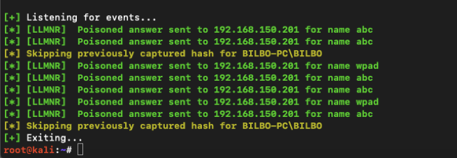

Navigating over back over to our Kali Machine and into the ‘/usr/share/responder/logs/ directory we can see that we have generated a new file called ‘SMBv2-NTLMv2-SSP-192.168.150.201.txt’. 
Looking at this file using the cat command, we can see that it contains a long hash. By using either hashcat or john the ripper, we can crack this hash to therefore obtain the username and password to the system.

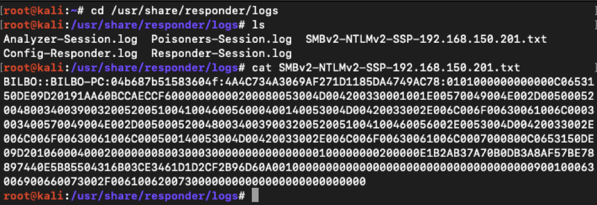


### 6. CVE

## II. Code Walkthrough

### 1. Sniffer 

Our first module that was built was the sniffer module. 
This module uses pyshark, a python wrapper for tshark which is the terminal version of wireshark, to sniff traffic. 
`get_capture` takes in either a file and an arbitrary amount of named parameters which are all grabbed by **kwargs<sup>[1]</sup>. 
If a file is passed `_read_cap` is called else `_sniff` is called.
```python
def get_capture(file=None, **kwargs):
    if file:
        capture = _read_cap(file)
    else:
        capture = _sniff(**kwargs)
    return capture
```

`_read_cap` is quite trivial. It uses pyshark's `FileCapture` to read in a *pcap* and return a capture object. The capture object is essentially a list of packets from the pcap.

```python
def _read_cap(in_file):
    cap = pyshark.FileCapture(in_file)
    return cap
```

`_sniff` is a little bit more complex. 
It takes in four arguments: *interface*, *timeout*, *continuous*, and *out_file*.
*interface* is a string that relates to the interface on the machine that you want to sniff on. 
If an interface is not provided then `_choose_interface` will be called.
*timeout* is an integer that represents how many packeets you would like to capture.
*continous* is a boolean, that if True allows you to capture continuously instead of just a number of packets.
*out_file* is a string, that if provided, will allow the user to output their capture to a pcap.

```python
def _sniff(interface=None, timeout=10, continuous=True, out_file=None):
    if not interface:
        interface = _choose_interface()

    if out_file:
        capture = pyshark.LiveCapture(output_file=out_file,
                                      interface=interface)
    else:
        capture = pyshark.LiveCapture(interface=interface)

    if continuous:
        capture.sniff_continuously()
    else:
        capture.sniff(timeout=timeout)

    return capture
```

`_chose_interface` is a utility function that aids a user if they do not know their network adapter' names.
It uses a python module called *netifaces* to list all the network interfaces on a machine.
On Windows it is a little bit more complicated.
Windows machines will respond with GUIDs that relate to registry keys instead of adapter names like `eth0` or `en0`.
However, doing registry lookups with *winreg* a builtin module found only on Windows machines one can recover the adapter names.
After the adapter names are enumerated the user will be prompted to select which adapter they would like to sniff on.

```python
def _choose_interface():
    interfaces = netifaces.interfaces()

    if os.name == 'nt':

        iface_names = ['(unknown)' for i in range(len(interfaces))]
        reg = wr.ConnectRegistry(None, wr.HKEY_LOCAL_MACHINE)
        reg_key = wr.OpenKey(
            reg, r'SYSTEM\CurrentControlSet\Control\Network\{4d36e972-e325-11ce-bfc1-08002be10318}')
        for counter, interface in enumerate(interfaces):
            try:
                reg_subkey = wr.OpenKey(
                    reg_key, interface + r'\Connection')

                iface_names[counter] = wr.QueryValueEx(reg_subkey, 'Name')[0]
            except FileNotFoundError:
                pass
        interfaces = iface_names

    print('Select Interface: ')

    for val, count in enumerate(interfaces):
        print(val, count)

    selection = int(input())

    return interfaces[selection]
```

### 2. IDS_Nmap

`sniffer` is used in all of the IDS detection modules. 
One of these modules is `ids_nmap`.
It provides detection against NMAP's XMAS Scans, ACK Scans, and SYN Scans.
`xmas_signature_detection` takes in file and an arbitrary amount of named arguments. These arguments are both passed to `sniffer.get_capture`. 
The capture object that is returned by the prior call is then iterated through.
XMAS attacks use TCP Packets that use TCP Flags: FIN, RES, and PSH. 
Therefore our detection first checks to see if the packet is using TCP and if it is then it checks to see if the correct flags are set.
Benign traffic does not set these flags so if they appear its most likely an XMAS scan.

```python
def xmas_signature_detection(file=None, **kwargs):
    capture = sniffer.get_capture(file, **kwargs)
    detected = False

    for packet in capture:
        if packet.transport_layer == 'TCP':
            if int(packet.tcp.flags, 16) == 41: 
                print(f'XMAS ATTACK in packet number: {packet.number}')
                detected = True
    return detected
```

For `ack_heuristic_detection` we take in the same parameters and pass them to `sniffer`.
The idea behind an ACK Scan is that the scanning machine will probe every port for a specific machine and set only the ACK TCP flag. 
Setting the ACK TCP flag and only that flag is not abnormal behavior in of itself.
However, doing this to multiple unique ports is quite suspicious. 
Therefore, for our implementation we look at TCP packets and log all the unique ports every IP probes with only the ACK TCP flag set.
If this counter passes a predefined value, which we have set to 10, it is flagged.

```python
def ack_heuristic_detection(file=None, **kwargs):
    capture = sniffer.get_capture(file, **kwargs)
    uniq_ip = collections.defaultdict(set)
    detected = False

    for packet in capture:
        if packet.transport_layer == 'TCP':
            if int(packet.tcp.flags, 16) == 16:  
                uniq_ip[packet.ip.addr].add(packet.tcp.dstport)
                if len(uniq_ip[packet.ip.addr]) > MAX_UNIQUE_PORTS:
                    print(f'ACK ATTACK in packet number: {packet.number}')
                    detected = True

    return detected
```

The same idea is applied to `syn_heuristic_detection`. Here, however, we are looking for SYN scans. 
Which are similar to ACK scans. Except SYN scans only set the SYN TCP flag.
Using the same logic as before we can detect these types of scans.
```python
def syn_heuristic_detection(file=None, **kwargs):
    capture = sniffer.get_capture(file, **kwargs)
    uniq_ip = collections.defaultdict(set)
    detected = False

    for packet in capture:
        if packet.transport_layer == 'TCP':
            if int(packet.tcp.flags, 16) == 2:
                uniq_ip[packet.ip.addr].add(packet.tcp.dstport)
                if len(uniq_ip[packet.ip.addr]) > MAX_UNIQUE_PORTS:
                    print(f'SYN ATTACK in packet number: {packet.number}')
                    detected = True

    return detected
```

### 3. IDS Ettercap

Another type of attack we aim to detect against is Ettercap's ARP poisioning. 
`heuristic_detection` takes in the same parameters as seen before and passes it to `sniffer`. `heuristic_detection` checks for suspicious activity in the network traffic by looking for the host discovery process used by ettercap when setting up 
	an arp poisoning attack. The way we have implemented this scan is
	by counting the number of consecutive ARP requests made by a specific host. 
	If the number of consecutive arp requests made by the same host exceeds a set threshold value,
	the ids alerts the host machine, and returns a warning.

```python
def heuristic_detection(file=None, **kwargs):
    capture = sniffer.get_capture(file, **kwargs)
    was_detected = False
    host_in_question = ""
    concurrent_arp_req_count = 0
    arp_req_threshold = 30

    for packet in capture:
        if 'arp' in packet:
            if packet.arp.opcode == '1':  # if the arp packet is an arp request
                if host_in_question == "":
                    host_in_question = packet.eth.src  # set first MAC SRC address for ARP messages
                elif host_in_question == packet.eth.src:  # if the current mac equals the previous mac
                    concurrent_arp_req_count += 1
                else:
                    host_in_question = packet.eth.src
                    concurrent_arp_req_count = 0
                # if the number of concurrent arp_requests with the same src exceeds our threshold there's a problem
                if concurrent_arp_req_count >= arp_req_threshold:
                    print("ARP POISONING DETECTED!!! FLAGGED PACKET:", packet.number)
                    was_detected = True
    return was_detected
```

`behavioral_detection` checks for suspicious activity in the network traffic by checking for gratuitous ARP replies.
The way we have implemented this scan is by counting the number of ARP replies and ARP requests. 
With normal traffic, more ARP requests are made than ARP replies. With the counted number of request and replies, we examine the ratio between the two. 
If e number of request far exceeds the number of replies, we know that a host is making gratuitous ARP packet. 
We flag the packets deemed as gratuitous ARPs and alert the host machine.

```python
def behavioral_detection(file=None, **kwargs):
    capture = sniffer.get_capture(file, **kwargs)
    was_detected = False
    previous_arp_type = None
    current_arp_type = None
    concurrent_arp_reply_threshold = 4
    concurrent_arp_reply_count = 0
    request = '1'
    reply = '2'

    for packet in capture:
        if 'arp' in packet:
            current_arp_type = packet.arp.opcode
            # check if the previous message was a request
            if current_arp_type == reply:  # if it's a reply
                if previous_arp_type == request:
                    # clear the previous message and move on
                    previous_arp_type = current_arp_type
                    concurrent_arp_reply_count = 0
                else:
                    concurrent_arp_reply_count += 1
                    # if it was NOT, there's a problem
                    if concurrent_arp_reply_count > concurrent_arp_reply_threshold:
                        print(
                            "GRATUITOUS ARP DETECTED!!! FLAGGED PACKET:", packet.number)
                        was_detected = True
            else:  # if it is a request
                previous_arp_type = request
    return was_detected

```


### 4. IDS Responder 

Responder's spoofing is one of the last attacks we are trying to protect against.
Responder uses LLMNR, NBT-NS, and MDNS poisioning attacks. Essestially, we can use these kind of spoofing attacks agaisnt a network when a victim sends a bad DNS requests to a server. Once this bad request has been sent, we act as a 'Man-in-the-Middle' and our Kali machine acts as the machine that the victim wants to connect to. Once this connection has been made, we get the SMB.txt file from the client and we can therefore crack this hash offline to get valuable information about the victim machine.   
In our code we assume that one machine in the network has been setup to be the domain controller.
Therefore if traffic is seen from an IP that is not the domain controller on specific protocols, NBNS and LLMNR, that only the domain controller should be sending on we assume responder is trying to spoof the network. 
The hardcoded *DOMAIN_IP* will need to be changed per network as it will not always be the same.

```python
DOMAIN_IP = '192.168.150.201'  


def behavioral_detection(file=None, **kwargs):

    capture = sniffer.get_capture(file, **kwargs)
    detected = False

    for packet in capture:
        try:
            if ('nbns' in packet or 'llmnr' in packet) and packet.ip.src != DOMAIN_IP:
                print(
                    f'Responder ATTACK deteced in packet number: {packet.number}')
                detected = True
        except AttributeError:
            pass
    return detected
```

## III. Detection

### 0. Setup

Before running any of the detections you must ensure the framework is setup properly

* Ensure Python 3 is installed
    * If you are running on a *NIX system or Mac it should be installed by default
        * Run `python3 -V` to double check
        * If that command fails try `python -V`, as long as the version is greater than 3.6 the program will work
    * To install python 3 run
        * Debian Based
            * `sudo apt install python3 python3-pip -y`
        * Mac
            * `brew install python3`
            * `sudo easy_install pip`
        * Windows
            * `choco install python3`
* Ensure Wireshark is installed
    * Debian Based
        * `sudo apt install wireshark -y`
    * Mac
        * `brew cask install wireshark`
    * Windows
        * `choco install wireshark`
* Install Python dependancies
    * Make sure you are in the root directory for this project
    * `pip3 install -r requirements.txt`

### 1. NMAP ACK Scan

Simply run `python3 src/ids.py` to start the IDS. 
It will prompt you for the interface you want to listen on.

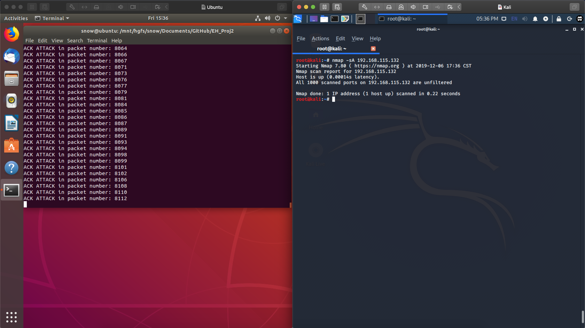

### 2. NMAP SYN Scan


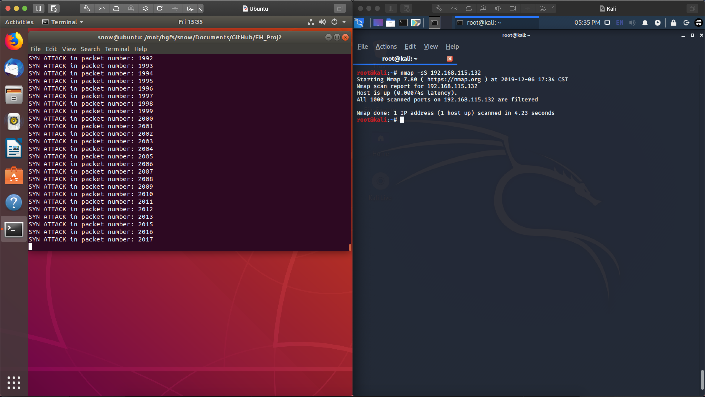

### 3. NMAP XMAS Scan


### 4. Ettercap

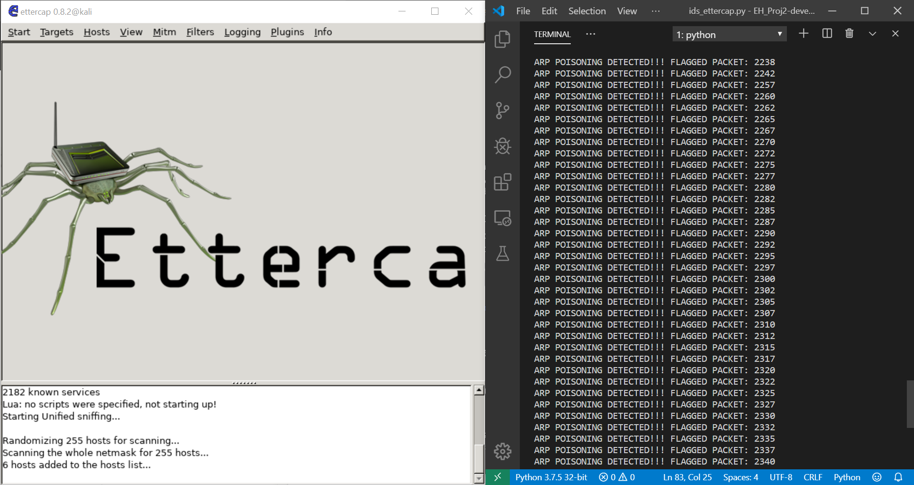

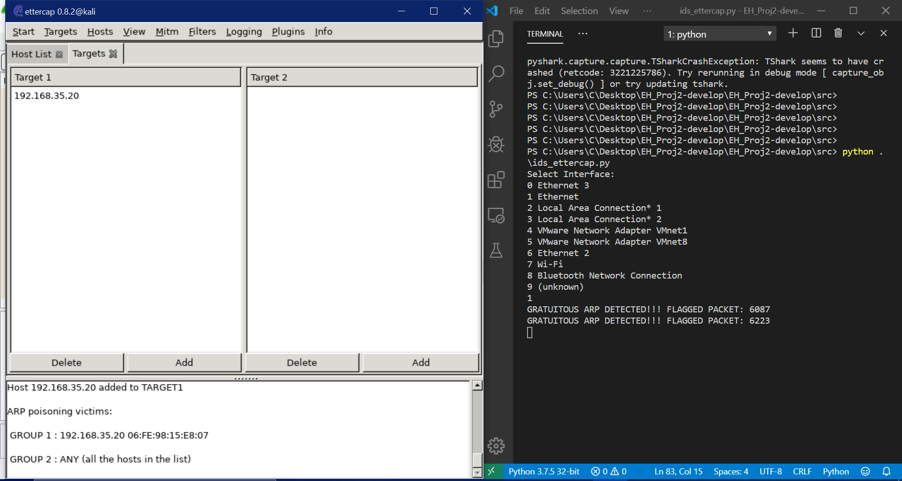

### 5. Responder

### 6. CVE

# Recommendations


# Conclusion


# Appendix

## I. Sniffer Code

```python
"""
Module to sniff packets from a local interface for a
certain period of time.

Can also read in pre-existing captures and dump the
captures to standard output.

Author: Jordan Sosnowski
Date: 11/22/2019
"""
import os
try:
    import winreg as wr
except ImportError:
    pass
import pyshark
import netifaces


def _choose_interface():
    """
    Allows user to select interface based
    on system interfaces
    """
    interfaces = netifaces.interfaces()

    if os.name == 'nt':
        # allows windows machines to choose interfaces
        iface_names = ['(unknown)' for i in range(len(interfaces))]
        reg = wr.ConnectRegistry(None, wr.HKEY_LOCAL_MACHINE)
        reg_key = wr.OpenKey(
            reg, r'SYSTEM\CurrentControlSet\Control\Network\{4d36e972-e325-11ce-bfc1-08002be10318}')
        for counter, interface in enumerate(interfaces):
            try:
                reg_subkey = wr.OpenKey(
                    reg_key, interface + r'\Connection')

                iface_names[counter] = wr.QueryValueEx(reg_subkey, 'Name')[0]
            except FileNotFoundError:
                pass
        interfaces = iface_names

    print('Select Interface: ')

    for val, count in enumerate(interfaces):
        print(val, count)

    selection = int(input())

    return interfaces[selection]


def _sniff(interface=None, timeout=10, continuous=True, out_file=None):
    """
    Sniffs packet on specified interface, either for a
    specified number of seconds or forever.

    If interface is not specified local interface will
    be listed. If an outfile is provided the function
    will save the packet file.

    args:
        interface (str): represents interface to listen on
            defaults -> en0

        timeout (int): represents the time to record packets for
            defaults -> 10

        continuous (boolean): represents whether or not to capture
        in continuous mode or to sniff for a certain number of packets

        out_file (str): represents the file to output saved
        captures to
            defaults -> None

    returns:
        capture object
    """
    if not interface:
        interface = _choose_interface()

    # if out_file is provided, output capture
    if out_file:
        capture = pyshark.LiveCapture(output_file=out_file,
                                      interface=interface)
    else:
        capture = pyshark.LiveCapture(interface=interface)

    # if continuous sniff continuously, other sniff for timeout
    if continuous:
        capture.sniff_continuously()
    else:
        capture.sniff(timeout=timeout)

    return capture


def _read_cap(in_file):
    """ Reads capture file in and returns capture object """
    cap = pyshark.FileCapture(in_file)
    return cap


def dump_cap(capture):
    """ Dumps capture object's packets to standard output """
    for packet in capture:
        packet.pretty_print()


def get_capture(file=None, **kwargs):
    """
    Controller method for sniffer

    If file is none, assume user wanted to sniff traffic rather
    than use a file capture
    """
    if file:
        capture = _read_cap(file)
    else:
        capture = _sniff(**kwargs)
    return capture

```

## II. IDS Code


## III. NMAP IDS Code

```python
"""
An IDS system for detecting nmap xmas attacks, ack attacks, and syn attacks

Author: Jordan Sosnowski
Date: Nov 26 2019

"""

import collections
import sniffer


MAX_UNIQUE_PORTS = 10


def xmas_signature_detection(file=None, **kwargs):
    """
    xmas detection function

    uses the signature of TCP Flag == 0x29
    """
    capture = sniffer.get_capture(file, **kwargs)
    detected = False

    for packet in capture:
        # ensure packet is TCP as xmas attacks run over TCP
        if packet.transport_layer == 'TCP':
            # ensure that the only flags set are the push, urgent, and final flags
            # usually those flags should not be set, and if they are its probably
            # an xmas attack
            if int(packet.tcp.flags, 16) == 41:  # '0x00000029'
                print(f'XMAS ATTACK in packet number: {packet.number}')
                detected = True
    return detected


def ack_heuristic_detection(file=None, **kwargs):
    """
    ack detection function

    uses the heursitic of uniq ports > MAX_UNIQUE_PORTS and if
    TCP flag == 0x10
    """
    capture = sniffer.get_capture(file, **kwargs)
    uniq_ip = collections.defaultdict(set)
    detected = False

    for packet in capture:
        # ensure packet is using TCP as ack attacks run over TCP
        if packet.transport_layer == 'TCP':
            # ensure packet is only setting the ACK flag
            if int(packet.tcp.flags, 16) == 16:  # 0x10
                uniq_ip[packet.ip.addr].add(packet.tcp.dstport)

                # if the number of unique dst ports are more then MAX_UNIQUE_PORTS flag it
                if len(uniq_ip[packet.ip.addr]) > MAX_UNIQUE_PORTS:
                    print(f'ACK ATTACK in packet number: {packet.number}')
                    detected = True

    return detected


def syn_heuristic_detection(file=None, **kwargs):
    """
    syn detection function

    uses the heursitic of uniq ports > MAX_UNIQUE_PORTS and if
    TCP flag == 0x2
    """
    capture = sniffer.get_capture(file, **kwargs)
    uniq_ip = collections.defaultdict(set)
    detected = False

    for packet in capture:
        # ensure packet is using TCP as syn attacks run over TCP
        if packet.transport_layer == 'TCP':
            # ensure packet is only setting the SYN flag
            if int(packet.tcp.flags, 16) == 2:
                uniq_ip[packet.ip.addr].add(packet.tcp.dstport)

                # if the number of unique dst ports are more than MAX_UNIQUE_PORTS flag it
                if len(uniq_ip[packet.ip.addr]) > MAX_UNIQUE_PORTS:
                    print(f'SYN ATTACK in packet number: {packet.number}')
                    detected = True

    return detected
```

## IV. Ettercap IDS Code

```python
"""
Ettercap detection module

Author: Charles Harper
Date: Nov 12, 2019
"""

import sniffer

# ARP POISONING CHECKS
# 1. check the number of arp requests in a row over the network
# if it exceeds 10 in a row, we know they're running network discovery
# otherwise, it should be ok
# 2. check if the arp reply contains information about duplicate-addresses
# if it does, they're most likely running arp poisoning
# if it isn't, it should be ok
# 3. assuming they get passed the arp request count check, keep count of the number arp req to
# arp replys

# if the replies far exceeds the replies, we know that an arp spoof is taking place
# otherwise, we should be ok

# depricated function 2 as it's a built-in warning associated with wireshark (i think),
# and will not work with tshark


def heuristic_detection(file=None, **kwargs):
    capture = sniffer.get_capture(file, **kwargs)
    was_detected = False
    host_in_question = ""
    concurrent_arp_req_count = 0
    arp_req_threshold = 30

    for packet in capture:
        if 'arp' in packet:
            if packet.arp.opcode == '1':  # if the arp packet is an arp request
                if host_in_question == "":
                    host_in_question = packet.eth.src  # set first MAC SRC address for ARP messages
                elif host_in_question == packet.eth.src:  # if the current mac equals the previous mac
                    concurrent_arp_req_count += 1
                else:
                    host_in_question = packet.eth.src
                    concurrent_arp_req_count = 0
                # if the number of concurrent arp_requests with the same src exceeds our threshold there's a problem
                if concurrent_arp_req_count >= arp_req_threshold:
                    print("ARP POISONING DETECTED!!! FLAGGED PACKET:", packet.number)
                    was_detected = True
    return was_detected


def behavioral_detection(file=None, **kwargs):
    capture = sniffer.get_capture(file, **kwargs)
    was_detected = False
    previous_arp_type = None
    current_arp_type = None
    concurrent_arp_reply_threshold = 4
    concurrent_arp_reply_count = 0
    request = '1'
    reply = '2'

    for packet in capture:
        if 'arp' in packet:
            current_arp_type = packet.arp.opcode
            # check if the previous message was a request
            if current_arp_type == reply:  # if it's a reply
                if previous_arp_type == request:
                    # clear the previous message and move on
                    previous_arp_type = current_arp_type
                    concurrent_arp_reply_count = 0
                else:
                    concurrent_arp_reply_count += 1
                    # if it was NOT, there's a problem
                    if concurrent_arp_reply_count > concurrent_arp_reply_threshold:
                        print(
                            "GRATUITOUS ARP DETECTED!!! FLAGGED PACKET:", packet.number)
                        was_detected = True
            else:  # if it is a request
                previous_arp_type = request
    return was_detected

```

## V. Responder IDS Code

```python
"""
An IDS system for detecting responder attacks

Author: John David Watts
Date: Decemeber 12 2019
"""

import sniffer


DOMAIN_IP = '192.168.150.201'  # should change per network


def behavioral_detection(file=None, **kwargs):
    """
    function to detect responders spoofing attacks

    assumes that only one IP is acting as the domain controller and
    assume as an admin you know the IP
    """
    capture = sniffer.get_capture(file, **kwargs)
    detected = False

    for packet in capture:
        # ensure packet is either an 'NBNS' or 'LLMNR'
        # as responder attacks run through these protocols
        try:
            if ('nbns' in packet or 'llmnr' in packet) and packet.ip.src != DOMAIN_IP:
                print(
                    f'Responder ATTACK deteced in packet number: {packet.number}')
                detected = True
        except AttributeError:
            # some LLMNR packets are transmitted via link layer and not the internet layer
            # meaning they only have MAC addresses and not IP
            pass
    return detected

```

## VI. CVE-2017-010 IDS Code


# References

[1]: https://stackoverflow.com/questions/1769403/what-is-the-purpose-and-use-of-kwargs
[2]: https://nmap.org/book/man-port-scanning-techniques.html
[3]: https://pentestmag.com/ettercap-tutorial-for-windows/
[4]: https://www.notsosecure.com/pwning-with-responder-a-pentesters-guide/
[5]: https://tools.kali.org/sniffingspoofing/responder
[6]: https://forums.kali.org/showthread.php?36036-Penetration-Testing-How-to-use-Responder-py-to-Steal-Credentials
[7]: https://www.4armed.com/blog/llmnr-nbtns-poisoning-using-responder/
[8]: https://null-byte.wonderhowto.com/how-to/use-ettercap-intercept-passwords-with-arp-spoofing-0191191/
[9]: https://linux.die.net/man/8/ettercap
[10]: https://linux.die.net/man/1/nmap


For this process we are going to use the lab machines to show that an attack against the Windows 7 machine (.200) from the Kali Machine (.10). 
As stated previously we are going to use the responder tool in Kali Linux to perform an ‘Man-in-the-Middle’ attack by intercepting the traffic flow from a bad DNS server call from the Windows 7 machine. 
Once we send an LLMNR or a NETBIOS broadcast from the Kali Machine, the Windows 7 machine will accept this broadcast. 
Once this broadcast has been accepted, our attacker will grab a file named ‘SMBv2-NTLMv2-SSP-192.168.150.201.txt’ in which we can decrypt in order to see the username and passwords. 

Now that we know what exactly will happen on the network, we can easily see how our IDS needs to be implemented in order to help prevent this attack. 
To prevent this attack, all we need to check for is if the source IP address is not the source IP addresses of the DNS server or the Windows 7 machine which we will already know as we are familiar with what network we are on. 
If this source IP address is not the Windows 7 machine (192.168.x.201) or the DNS server we are trying to connect to, then we need to check what source is sending packets. 
For this instance, our behavioral IDS checks to see that the source equals 192.168.x.201, if it does not match, then we send a message to the user saying that there is an issue. 
These checks are done on both NBNS protocols and LLMNR protocols as shown below.